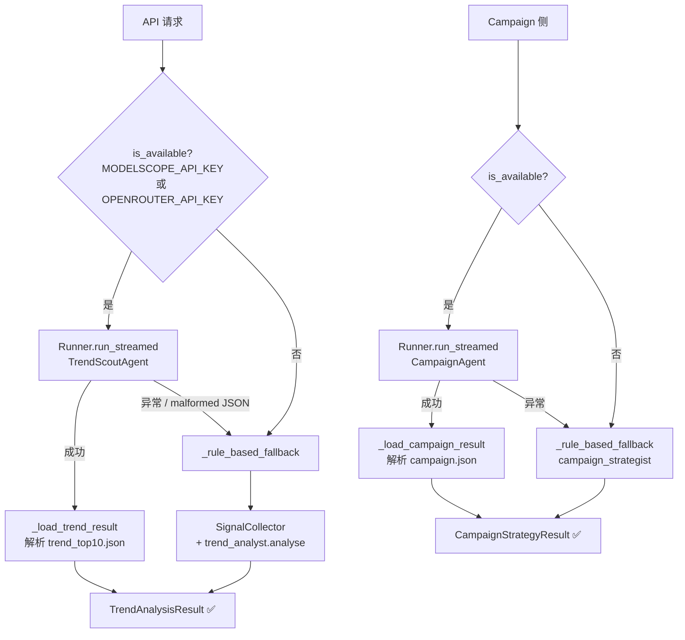
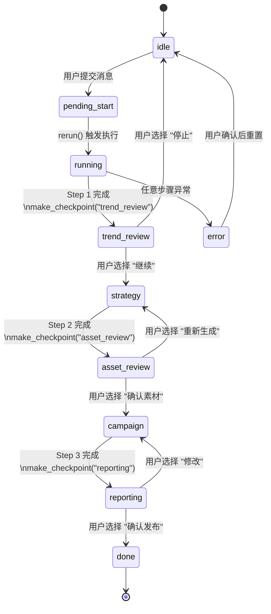

# Agent 层深度参考

> 扩展或调试 LLM 驱动组件的完整手册。  
> 设计来源：[Notion PRD v4](https://www.notion.so/faych/34e5f3c4a139801e806cd49a2af60591)

---

## 1. 框架选择：openai-agents SDK

### 原始设计选型：Hermes Agent

PRD v4 原始设计选择 **Hermes Agent**（NousResearch）作为 Agent 框架，核心理由：
- **Skills System**：预定义技能库，开箱即用的 XHS/Douyin 数据采集技能
- **Self-improving Loop**：内建对话历史 + Honcho 记忆，自然支持 K2 Strategy Loop
- **Subagent Delegation**：`delegate` 语法直接调度子 Agent
- **FTS5 + Honcho Memory**：原生多层记忆，对应 Memory Fabric L2/L3

### 当前实现：openai-agents SDK

本轮开发迁移至 **openai-agents SDK**（v0.17+），三个具体理由：

**理由 1**：`Runner.run_streamed()` + `stream_events()` 原生支持 Streamlit 进度回传。
```python
# nails_agent/agents/trend_agent.py
async with Runner.run_streamed(agent, message, max_turns=30) as stream:
    async for event in stream.stream_events():
        ...  # 实时推送进度到 Chat UI
```

**理由 2**：`strict_mode=False` 绕过 JSON Schema 严格检查，允许 Qwen3 传 `list[dict]` 参数。
```python
# nails_agent/agents/nail_tools.py
@function_tool(strict_mode=False)
def save_trend_analysis(style_trends: list[dict], top_10_signals: list[dict], ...) -> str:
    ...  # Qwen3 动态组装的 list[dict] 不会触发 schema 验证错误
```

**理由 3**：`handoff()` 实现 NailsOrchestrator → TrendScoutAgent/CampaignAgent 的路由，语义明确。
```python
# nails_agent/agents/nail_agents.py
get_orchestrator_agent() → Agent(
    handoffs=[transfer_to_trend_scout, transfer_to_campaign]
)
```

---

## 2. Agent 角色清单

PRD v4 定义 **9 个角色**，分三层：

### 触发 & 协调层

| Agent | 职责 | 实现文件 | 状态 |
|-------|------|---------|------|
| **Trigger Gateway** | 解析触发信号（关键词/Webhook/Cron），路由到目标 pipeline | `api/main.py` POST /chat, /pipeline/* | ✅ |
| **Orchestrator** | 全局步骤编排；管理 `PipelineState`；驱动并行/串行执行 | `agents/orchestrator.py` + `nail_agents.py` `get_orchestrator_agent()` | ✅ |

### 执行层（核心分析）

| Agent | tools 数量 | 实现文件 | 状态 |
|-------|-----------|---------|------|
| **Trend Analyst** | 5（search_xhs / search_douyin / search_instagram / get_style_library / save_trend_analysis） | `nail_agents.py` `get_trend_scout_agent()` + `trend_analyst.py` | ✅ |
| **Value Evaluator** | — (rule-based worker) | `workers/value_evaluator.py` | ✅ |
| **Asset Generator** | — (rule-based worker) | `workers/asset_generator.py` | ✅ |
| **Campaign Strategist** | 4（load_trend_context / check_xhs_compliance / save_campaign_card / finalise_campaign） | `nail_agents.py` `get_campaign_agent()` + `campaign_strategist.py` | ✅ |
| **Summarizer** | — (rule-based worker) | `workers/summarizer.py` | ✅ |

### 控制 & 执行层

| Agent | 职责 | 实现 | 状态 |
|-------|------|------|------|
| **Reviewer Guardrail** | 在任意步骤边界插入人机协作 Checkpoint；运营人员在 Chat UI 确认后放行（K5） | `agents/chat_runner.py` `make_checkpoint()` + 11 相状态机 | ✅ |
| **Action Executor** | 将审核通过的运营计划发布到小红书/抖音/Instagram；记录发布状态（K4 闭环） | 设计中，计划对接 xhs-mcp / AiToEarn MCP | 🔲 |

---

## 3. Tool 参考手册

所有 `@function_tool` 定义在 `nails_agent/agents/nail_tools.py`。

### `search_xhs`

```python
@function_tool
def search_xhs(keywords: list[str], limit_per_keyword: int = 20) -> str:
```

- **调用方**：TrendScoutAgent（Step 1）
- **返回**：JSON `{"count": N, "signals": [TrendSignal...]}`
- **数据源**：XHS-MCP Go server `:18060`；Go server 未运行则返回 `{"signals": [], "error": "..."}`
- **Fallback**：`SignalCollector` mock 数据（`demo/data/`）

---

### `search_douyin`

```python
@function_tool
def search_douyin(keywords: list[str], limit_per_keyword: int = 15) -> str:
```

- **调用方**：TrendScoutAgent
- **数据源**：Chrome CDP `:9222`；CDP 不可用则静默返回空列表

---

### `search_instagram`

```python
@function_tool
def search_instagram(tags: list[str], limit_per_tag: int = 15) -> str:
```

- **调用方**：TrendScoutAgent
- **数据源**：Playwright / instaloader；不可用则返回空

---

### `get_style_library`

```python
@function_tool
def get_style_library() -> str:
```

- **调用方**：TrendScoutAgent（计算款式缺口 gap_score 时）
- **返回**：JSON，来自 `demo/data/style_library.json` 或 SQLite `nail_styles_v2`

---

### `save_trend_analysis` ⚠️ strict_mode=False

```python
@function_tool(strict_mode=False)
def save_trend_analysis(
    style_trends: list[dict],
    top_10_signals: list[dict],
    patterns: list[str],
    anomalies: list[str],
    summary: str,
) -> str:
```

- **`strict_mode=False` 原因**：`list[dict]` 参数类型在 OpenAI strict JSON schema 下会触发 `additionalProperties` 报错；Qwen3 动态组装的结构体需要此豁免
- **写盘**：`demo/output/trend_top10.json`
- **写 SQLite**：`memory` 表（kind=trend/pattern/anomaly）

---

### `check_xhs_compliance`

```python
@function_tool
def check_xhs_compliance(copy_text: str) -> str:
```

- **调用方**：CampaignAgent（文案合规检查，Step 3）
- **规则**：18 个禁用词（"最好"/"第一"/"绝对"/"AI 智能"/"赋能"等）
- **返回**：`{"compliant": true}` 或 `{"compliant": false, "issues": [...]}`

---

### `load_trend_context`

```python
@function_tool
def load_trend_context(limit: int = 5) -> str:
```

- **调用方**：CampaignAgent（Step 3 开始前读取趋势背景）
- **读取**：优先读 `demo/output/trend_top10.json`；不存在时从 SQLite `memory` 表（kind=trend）查询
- **K2 Strategy Loop**：读取包含历史 `insight` 条目，让 CampaignAgent 基于跨 run 积累经验决策

---

### `save_campaign_card`

```python
@function_tool(strict_mode=False)
def save_campaign_card(
    style_name: str,
    style_id: str,
    trend_score: float,
    platform_copies: dict,
    pricing: dict,
    schedule: dict,
) -> str:
```

- **调用方**：CampaignAgent（每个款式生成后调用一次）
- **写盘**：追加到 `demo/output/_campaign_cards.json`

---

### `finalise_campaign`

```python
@function_tool
def finalise_campaign(executive_summary: str, top_3_styles: list[str]) -> str:
```

- **调用方**：CampaignAgent（所有款式处理完后调用）
- **写盘**：合并 `_campaign_cards.json` → `demo/output/campaign.json`
- **写 SQLite**：`memory` 表（kind=style_card）

---

## 4. System Prompt 设计原则

### TrendScoutAgent

```
你是资深美甲趋势分析师。任务：
1. search_xhs → search_douyin → search_instagram（依次调用，不跳步）
2. 调用 get_style_library 计算款式缺口
3. 对每个 style_trend 计算 aggregated_score（0-100 归一化）
4. 调用 save_trend_analysis 写盘（必须执行，不得省略）

幻觉防护：仅基于工具返回数据分析，禁止编造帖子数据。
```

关键设计点：
- **numbered workflow**：防止 LLM 跳步（实测 Qwen3 会跳过 instagram）
- **score 公式内联**：`aggregated_score = (engagement_sum / max_engagement) * 100`，减少幻觉
- **save 强制写盘**：不显式要求则 Qwen3 经常只输出文字不调用 tool

### CampaignAgent

```
你是美甲品牌运营总监。规则：
- 对每个 P0 款式：check_xhs_compliance 通过后才 save_campaign_card
- ✅ 合规 / ❌ 违规（替代散文描述，节省 token）
- 定价区间：基础款 ¥88-138 / 进阶款 ¥168-258 / 高端款 ¥298+
- 优先级：launch_priority_score > 70 → P0，40-70 → P1，< 40 → P2
- 禁止短语：AI智能 / 赋能 / 颠覆 / 引领潮流（小红书封号词）
```

### NailsOrchestrator

- 仅包含路由规则，**无领域知识**（防止 Orchestrator 越权执行分析）
- 禁止输出"AI 智能/赋能"短语（双重保险，与 CampaignAgent system prompt 一致）

---

## 5. Fallback 链



---

## 6. Agent–Disk 契约

### Agent 写盘（openai-agents @function_tools）

| 写入方 | 文件路径 | 读取方 |
|-------|---------|--------|
| `save_trend_analysis` | `demo/output/trend_top10.json` | `_load_trend_result()` / `load_trend_context` |
| `save_campaign_card` | `demo/output/_campaign_cards.json` | `finalise_campaign` |
| `finalise_campaign` | `demo/output/campaign.json` | `_load_campaign_result()` |

### Worker 写盘（Rule-based，orchestrator._persist_*）

| 写入方 | 文件路径 | 读取方 |
|-------|---------|--------|
| `_persist_trend` | `demo/output/trend_top10.json` | `load_trend_context` |
| `_persist_metrics` | `demo/output/metric_snapshots.json` | data_loader.py |
| `_persist_assets` | `demo/output/style_cards_draft.json` | CampaignAgent / campaign_strategist |
| `_persist_campaign` | `demo/output/campaign.json` + `demo/output/style_cards.json` | Summarizer |
| `_persist_summary` | `demo/output/report.md` | Streamlit 展示 |

> **扩展规则**：新增 Agent tool 写盘时，路径必须在 `NAILS_OUTPUT_DIR`（默认 `demo/output/`）下，文件名避免与上表冲突。

---

## 7. Chat 状态机（Reviewer Guardrail 集成）

Reviewer Guardrail（K5）通过 11 相状态机的 `make_checkpoint()` 实现：



**Two-phase commit 模式**（防 Streamlit 双重提交）：
1. 用户点击 → 写 `session_state.pending_choice` → `st.rerun()`
2. 下次 rerun → 检测 `pending_choice` → 执行实际逻辑 → 清除 `pending_choice`

**无需修改 `chat_app.py` 或 `chat_render.py`**：渲染器对所有 `CheckpointPayload` 通用处理，新增 Checkpoint 只需在 `chat_runner.py` 发出 `make_checkpoint()`。

---

## 8. 模型优先级解析

来源：`nails_agent/agents/agent_config.py`

```python
def make_model() -> OpenAIModel:
    """优先级：ModelScope → OpenRouter → raise"""
    if os.environ.get("MODELSCOPE_API_KEY"):
        # Qwen3-235B-A22B-Instruct-2507 via ModelScope
        ...
    if os.environ.get("OPENROUTER_API_KEY"):
        # claude-sonnet-4-5 via OpenRouter
        ...
    raise RuntimeError("No LLM API key configured")

def is_available() -> bool:
    return bool(os.environ.get("MODELSCOPE_API_KEY") or
                os.environ.get("OPENROUTER_API_KEY"))
```

两者都没有时，`orchestrator.py` 中 `use_agents=False`，全链路切 rule-based workers（CI 模式）。

---

## 9. Action Executor（设计规范）

> 🔲 未实现。以下为 PRD v4 设计规范，供后续实现参考。

**触发条件**：Reviewer Guardrail 在 `reporting` 阶段选择"确认发布"后，由 Orchestrator 调用。

**计划实现**：

```python
# nail_tools.py 新增
@function_tool
def publish_to_xhs(style_card_json: str, scheduled_at: str) -> str:
    """发布款式文案到小红书，返回发布任务 ID。"""
    # 对接 xhs-mcp（MCP server :18060，xhs_create_draft + xhs_publish_draft）
    ...

@function_tool
def publish_to_douyin(style_card_json: str) -> str:
    """发布款式视频/图文到抖音。"""
    ...
```

**写 SQLite**：新增 `publish_jobs` 表，记录发布状态（pending/success/failed）。

**注册到 Orchestrator**：在 `chat_runner.py` 的 `reporting → done` 路由中调用 Action Executor。

---

## 关键参考文件

- [`nails_agent/agents/nail_agents.py`](../../nails_agent/agents/nail_agents.py) — Agent 定义（lru_cache 工厂）
- [`nails_agent/agents/nail_tools.py`](../../nails_agent/agents/nail_tools.py) — 全部 @function_tool
- [`nails_agent/agents/agent_config.py`](../../nails_agent/agents/agent_config.py) — 模型优先级配置
- [`nails_agent/agents/chat_events.py`](../../nails_agent/agents/chat_events.py) — Phase / CheckpointPayload 定义
- [`nails_agent/agents/chat_runner.py`](../../nails_agent/agents/chat_runner.py) — 11 相状态机实现
- [`nails_agent/agents/orchestrator.py`](../../nails_agent/agents/orchestrator.py) — 4 步流水线 + _persist_*
- [`docs/scoring_formulas.md`](scoring_formulas.md) — 三维评分公式（Value Evaluator 数学基础）
