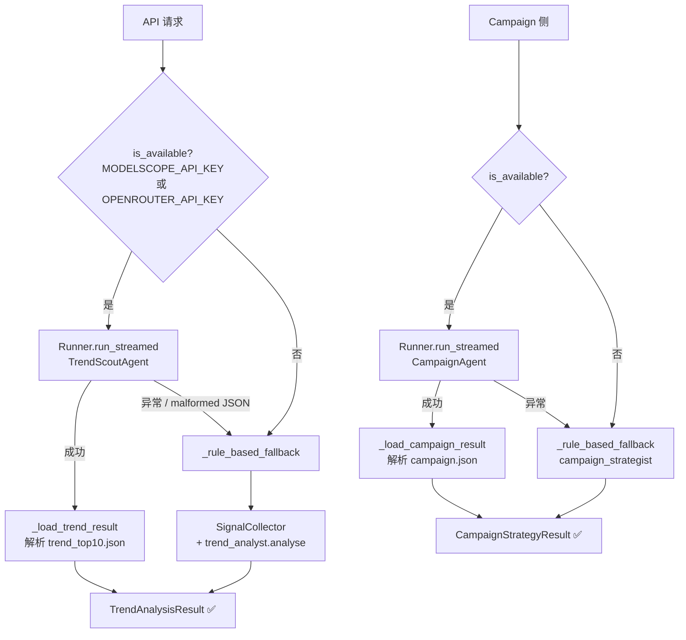
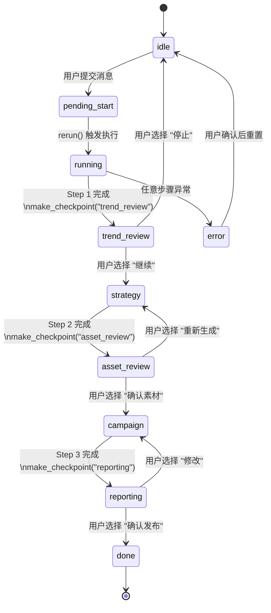

# Agent 层深度参考

> 扩展或调试 LLM 驱动组件的完整手册。  
> 设计来源：[Notion PRD v4](https://www.notion.so/faych/34e5f3c4a139801e806cd49a2af60591)

---

## 1. 框架选择：openai-agents SDK

### 原始设计选型：Hermes Agent

PRD v4 原始设计选择 **Hermes Agent**（NousResearch）作为 Agent 框架，核心理由：
- **Skills System**：预定义技能库，开箱即用的 XHS/Douyin 数据采集技能
- **Self-improving Loop**：内建对话历史 + Honcho 记忆，自然支持 K2 Strategy Loop
- **Subagent Delegation**：`delegate` 语法直接调度子 Agent
- **FTS5 + Honcho Memory**：原生多层记忆，对应 Memory Fabric L2/L3

### 当前实现：openai-agents SDK

本轮开发迁移至 **openai-agents SDK**（v0.17+），三个具体理由：

**理由 1**：`Runner.run_streamed()` + `stream_events()` 原生支持 Streamlit 进度回传。
```python
# nails_agent/agents/trend_agent.py
async with Runner.run_streamed(agent, message, max_turns=30) as stream:
    async for event in stream.stream_events():
        ...  # 实时推送进度到 Chat UI
```

**理由 2**：`strict_mode=False` 绕过 JSON Schema 严格检查，允许 Qwen3 传 `list[dict]` 参数。
```python
# nails_agent/agents/nail_tools.py
@function_tool(strict_mode=False)
def save_trend_analysis(style_trends: list[dict], top_10_signals: list[dict], ...) -> str:
    ...  # Qwen3 动态组装的 list[dict] 不会触发 schema 验证错误
```

**理由 3**：`handoff()` 实现 NailsOrchestrator → TrendScoutAgent/CampaignAgent 的路由，语义明确。
```python
# nails_agent/agents/nail_agents.py
get_orchestrator_agent() → Agent(
    handoffs=[transfer_to_trend_scout, transfer_to_campaign]
)
```

---

## 2. Agent 角色清单

PRD v4 定义 **9 个角色**，分三层：

### 触发 & 协调层

| Agent | 职责 | 实现文件 | 状态 |
|-------|------|---------|------|
| **Trigger Gateway** | 标准化触发入口；写 TriggerEvent 到 event_log；调用 Orchestrator.run_pipeline() | `agents/trigger_gateway.py` + `api/main.py` POST /api/v1/trigger | ✅ |
| **Orchestrator** | 全局步骤编排；管理 PipelineState + EventLog；驱动 run_pipeline() 完整链路 | `agents/orchestrator.py` | ✅ |

### 执行层（核心分析）

| Agent | tools 数量 | 实现文件 | 状态 |
|-------|-----------|---------|------|
| **Trend Analyst** | 5（search_xhs / search_douyin / search_instagram / get_style_library / save_trend_analysis） | `nail_agents.py` `get_trend_scout_agent()` + `trend_analyst.py` | ✅ |
| **Value Evaluator** | — (rule-based worker) | `workers/value_evaluator.py` | ✅ |
| **Asset Generator** | — (rule-based worker) | `workers/asset_generator.py` | ✅ |
| **Campaign Strategist** | 4（load_trend_context / check_xhs_compliance / save_campaign_card / finalise_campaign） | `nail_agents.py` `get_campaign_agent()` + `campaign_strategist.py` | ✅ |
| **Summarizer** | 汇总 TrendAnalysisResult + CampaignStrategyResult → CandidatePackage；计算 review_score | `agents/summarizer.py` | ✅ |

### 控制 & 执行层

| Agent | 职责 | 实现 | 状态 |
|-------|------|------|------|
| **Reviewer Guardrail** | 规则+LLM 两层审查 CandidatePackage，输出 ReviewDecision（pass/revise/reject）；HITL Checkpoint（K5） | `agents/reviewer_guardrail.py` + `POST /api/v1/review/approve` | ✅ |
| **Action Executor** | 将 HITL 确认后的 CandidatePackage 发布到 XHS（Go 草稿服务）或 OpenClaw webhook；写 ActionEvent | `agents/action_executor.py` + `POST /api/v1/action/publish` | ✅ |

---

## 3. Tool 参考手册

所有 `@function_tool` 定义在 `nails_agent/agents/nail_tools.py`。

### `search_xhs`

```python
@function_tool
def search_xhs(keywords: list[str], limit_per_keyword: int = 20) -> str:
```

- **调用方**：TrendScoutAgent（Step 1）
- **返回**：JSON `{"count": N, "signals": [TrendSignal...]}`
- **数据源**：XHS-MCP Go server `:18060`；Go server 未运行则返回 `{"signals": [], "error": "..."}`
- **Fallback**：`SignalCollector` mock 数据（`web/data/`）

---

### `search_douyin`

```python
@function_tool
def search_douyin(keywords: list[str], limit_per_keyword: int = 15) -> str:
```

- **调用方**：TrendScoutAgent
- **数据源**：Chrome CDP `:9222`；CDP 不可用则静默返回空列表

---

### `search_instagram`

```python
@function_tool
def search_instagram(tags: list[str], limit_per_tag: int = 15) -> str:
```

- **调用方**：TrendScoutAgent
- **数据源**：Playwright / instaloader；不可用则返回空

---

### `get_style_library`

```python
@function_tool
def get_style_library() -> str:
```

- **调用方**：TrendScoutAgent（计算款式缺口 gap_score 时）
- **返回**：JSON，来自 `web/data/style_library.json` 或 SQLite `nail_styles_v2`

---

### `save_trend_analysis` ⚠️ strict_mode=False

```python
@function_tool(strict_mode=False)
def save_trend_analysis(
    style_trends: list[dict],
    top_10_signals: list[dict],
    patterns: list[str],
    anomalies: list[str],
    summary: str,
) -> str:
```

- **`strict_mode=False` 原因**：`list[dict]` 参数类型在 OpenAI strict JSON schema 下会触发 `additionalProperties` 报错；Qwen3 动态组装的结构体需要此豁免
- **写盘**：`web/output/trend_top10.json`
- **写 SQLite**：`memory` 表（kind=trend/pattern/anomaly）

---

### `check_xhs_compliance`

```python
@function_tool
def check_xhs_compliance(copy_text: str) -> str:
```

- **调用方**：CampaignAgent（文案合规检查，Step 3）
- **规则**：18 个禁用词（"最好"/"第一"/"绝对"/"AI 智能"/"赋能"等）
- **返回**：`{"compliant": true}` 或 `{"compliant": false, "issues": [...]}`

---

### `load_trend_context`

```python
@function_tool
def load_trend_context(limit: int = 5) -> str:
```

- **调用方**：CampaignAgent（Step 3 开始前读取趋势背景）
- **读取**：优先读 `web/output/trend_top10.json`；不存在时从 SQLite `memory` 表（kind=trend）查询
- **K2 Strategy Loop**：读取包含历史 `insight` 条目，让 CampaignAgent 基于跨 run 积累经验决策

---

### `save_campaign_card`

```python
@function_tool(strict_mode=False)
def save_campaign_card(
    style_name: str,
    style_id: str,
    trend_score: float,
    platform_copies: dict,
    pricing: dict,
    schedule: dict,
) -> str:
```

- **调用方**：CampaignAgent（每个款式生成后调用一次）
- **写盘**：追加到 `web/output/_campaign_cards.json`

---

### `finalise_campaign`

```python
@function_tool
def finalise_campaign(executive_summary: str, top_3_styles: list[str]) -> str:
```

- **调用方**：CampaignAgent（所有款式处理完后调用）
- **写盘**：合并 `_campaign_cards.json` → `web/output/campaign.json`
- **写 SQLite**：`memory` 表（kind=style_card）

---

## 4. System Prompt 设计原则

### TrendScoutAgent

```
你是资深美甲趋势分析师。任务：
1. search_xhs → search_douyin → search_instagram（依次调用，不跳步）
2. 调用 get_style_library 计算款式缺口
3. 对每个 style_trend 计算 aggregated_score（0-100 归一化）
4. 调用 save_trend_analysis 写盘（必须执行，不得省略）

幻觉防护：仅基于工具返回数据分析，禁止编造帖子数据。
```

关键设计点：
- **numbered workflow**：防止 LLM 跳步（实测 Qwen3 会跳过 instagram）
- **score 公式内联**：`aggregated_score = (engagement_sum / max_engagement) * 100`，减少幻觉
- **save 强制写盘**：不显式要求则 Qwen3 经常只输出文字不调用 tool

### CampaignAgent

```
你是美甲品牌运营总监。规则：
- 对每个 P0 款式：check_xhs_compliance 通过后才 save_campaign_card
- ✅ 合规 / ❌ 违规（替代散文描述，节省 token）
- 定价区间：基础款 ¥88-138 / 进阶款 ¥168-258 / 高端款 ¥298+
- 优先级：launch_priority_score > 70 → P0，40-70 → P1，< 40 → P2
- 禁止短语：AI智能 / 赋能 / 颠覆 / 引领潮流（小红书封号词）
```

### NailsOrchestrator

- 仅包含路由规则，**无领域知识**（防止 Orchestrator 越权执行分析）
- 禁止输出"AI 智能/赋能"短语（双重保险，与 CampaignAgent system prompt 一致）

---

## 5. Fallback 链



---

## 6. Agent–Disk 契约

### Agent 写盘（openai-agents @function_tools）

| 写入方 | 文件路径 | 读取方 |
|-------|---------|--------|
| `save_trend_analysis` | `web/output/trend_top10.json` | `_load_trend_result()` / `load_trend_context` |
| `save_campaign_card` | `web/output/_campaign_cards.json` | `finalise_campaign` |
| `finalise_campaign` | `web/output/campaign.json` | `_load_campaign_result()` |

### Worker 写盘（Rule-based，orchestrator._persist_*）

| 写入方 | 文件路径 | 读取方 |
|-------|---------|--------|
| `_persist_trend` | `web/output/trend_top10.json` | `load_trend_context` |
| `_persist_metrics` | `web/output/metric_snapshots.json` | data_loader.py |
| `_persist_assets` | `web/output/style_cards_draft.json` | CampaignAgent / campaign_strategist |
| `_persist_campaign` | `web/output/campaign.json` + `web/output/style_cards.json` | Summarizer |
| `_persist_summary` | `web/output/report.md` | Streamlit 展示 |

> **扩展规则**：新增 Agent tool 写盘时，路径必须在 `NAILS_OUTPUT_DIR`（默认 `web/output/`）下，文件名避免与上表冲突。

---

## 7. Chat 状态机（Reviewer Guardrail 集成）

Reviewer Guardrail（K5）通过 11 相状态机的 `make_checkpoint()` 实现：



**Two-phase commit 模式**（防 Streamlit 双重提交）：
1. 用户点击 → 写 `session_state.pending_choice` → `st.rerun()`
2. 下次 rerun → 检测 `pending_choice` → 执行实际逻辑 → 清除 `pending_choice`

**无需修改 `chat_app.py` 或 `chat_render.py`**：渲染器对所有 `CheckpointPayload` 通用处理，新增 Checkpoint 只需在 `chat_runner.py` 发出 `make_checkpoint()`。

---

## 8. 模型优先级解析

来源：`nails_agent/agents/agent_config.py`

```python
def make_model() -> OpenAIModel:
    """优先级：ModelScope → OpenRouter → raise"""
    if os.environ.get("MODELSCOPE_API_KEY"):
        # Qwen3-235B-A22B-Instruct-2507 via ModelScope
        ...
    if os.environ.get("OPENROUTER_API_KEY"):
        # claude-sonnet-4-5 via OpenRouter
        ...
    raise RuntimeError("No LLM API key configured")

def is_available() -> bool:
    return bool(os.environ.get("MODELSCOPE_API_KEY") or
                os.environ.get("OPENROUTER_API_KEY"))
```

两者都没有时，`orchestrator.py` 中 `use_agents=False`，全链路切 rule-based workers（CI 模式）。

---

## 9. Action Executor

> ✅ 已实现：`nails_agent/agents/action_executor.py`

**触发条件**：商家在前端点击"确认执行" → `POST /api/v1/action/publish` → `ActionExecutor.publish(pkg, platform)`

**接口**：

```python
class ActionExecutor:
    def publish(self, pkg: CandidatePackage, platform: str) -> ActionEvent:
        """platform: 'xhs' | 'openclaw'"""
```

**XHS 实现**（调用 Go 服务）：

```python
# POST http://localhost:18060/api/v1/drafts/create
payload = {
    "title": pkg.trend_summary[:50],
    "content": f"{pkg.trend_summary}\n\n{pkg.strategy}",
    "images": pkg.assets[:9],  # XHS 最多 9 张图
}
```

**OpenClaw 实现**（webhook stub）：

```python
# POST $OPENCLAW_WEBHOOK_URL
payload = {
    "trigger_id": pkg.trigger_id,
    "message": f"【美甲趋势播报】{pkg.trend_summary[:100]}",
    "strategy": pkg.strategy[:200],
    "source": "nails-agent-platform",
}
```

**降级策略**：
- XHS Go 服务不可达 → `status="pending"`，写 ActionEvent 记录
- OpenClaw URL 未配置 → `status="pending"`，写 ActionEvent 记录
- 两者均不阻塞主链路

**输出**：`ActionEvent(action_id, trigger_id, platform, status, result_url)` 写入 event_log

---

## 10. MVP Agent 设计模式

平台选定 **openai-agents SDK** 的 4 种组合模式。新增 Agent 实现时按此模式选型。

### 模式 A — Orchestrator → Worker 顺序 spawn（主链路）

适用：B端运营链路（TrendAnalyst → ValueEvaluator → CampaignStrategist 顺序执行）

```python
# orchestrator.py：run_pipeline() 示意
async def run_pipeline(trigger: TriggerEvent) -> ReviewDecision:
    trend_result  = await Runner.run(trend_analyst_agent, trigger.model_dump_json())
    await event_log.write("TrendEvent", trend_result.final_output, trigger_id=trigger.trigger_id)
    value_result  = await Runner.run(value_evaluator_agent, trend_result.final_output)
    strategy      = await Runner.run(campaign_strategist_agent, value_result.final_output)
    candidate     = await Runner.run(summarizer_agent, strategy.final_output)
    await db.save_candidate_package(candidate.final_output, trigger_id=trigger.trigger_id)
    review        = await Runner.run(reviewer_guardrail_agent, candidate.final_output)
    return review.final_output  # ReviewDecision — 后续等 HITL approve
```

### 模式 B — Agent-as-Tool 并行（集群分析）

适用：TrendAnalyst 内部并行分析多个关键词集群（架构 v1 §5 `spawn cluster_a/b/c`）

```python
cluster_a = Agent(name="ClusterA_XHS",    tools=[search_xhs, search_douyin], ...)
cluster_b = Agent(name="ClusterB_IG",     tools=[search_instagram], ...)
trend_analyst_agent = Agent(
    name="TrendAnalyst",
    tools=[cluster_a.as_tool(), cluster_b.as_tool()],
    output_type=TrendAnalysisResult,
)
```

### 模式 C — Structured Output（所有 Worker 强制使用）

每个 Worker 输出固定 Pydantic model，禁止自由文本传递：

```python
from pydantic import BaseModel
from typing import Literal

class CandidatePackage(BaseModel):
    trigger_id: str; trend_summary: str; strategy: str; assets: list[str]; review_score: float

class ReviewDecision(BaseModel):
    status: Literal["pass", "revise", "reject"]
    reason: str; suggestions: list[str]; risk_flags: list[str]

summarizer_agent       = Agent(output_type=CandidatePackage, ...)
reviewer_guardrail_agent = Agent(output_type=ReviewDecision, ...)
```

### 模式 D — HITL Checkpoint（ReviewerGuardrail 专用）

ReviewerGuardrail 输出后，Action Executor 必须等人工确认才执行（K5）：

```
ReviewerGuardrail → ReviewDecision(status="pass")
    ↓ 写 candidate_packages(review_status="pending_human")
    ↓ 前端轮询 GET /api/v1/events，展示审查结论
    ↓ 商家点击确认 → POST /api/v1/review/approve
    ↓ Action Executor 触发
```

---

---

## 11. TriggerGateway（MVP 新增）

> `nails_agent/agents/trigger_gateway.py`

**职责**：标准化 pipeline 触发入口。不做趋势分析，只负责验证入参、分配 trigger_id、写首条 EventLog。

```python
class TriggerGateway:
    def fire(self, source: str, keywords: list[str], goal: str | None, shop_data: dict) -> TriggerEvent:
        event = TriggerEvent(source=source, keywords=keywords, ...)
        event_log.write(event_type="TriggerEvent", payload=event.model_dump(), trigger_id=event.trigger_id, agent_id="TriggerGateway")
        return event
```

**输入（via POST /api/v1/trigger）**：

| 字段 | 类型 | 说明 |
|------|------|------|
| source | str | "manual" \| "scheduled" \| "signal" |
| keywords | list[str] | 趋势关键词，可为空（用默认关键词） |
| goal | str? | 目标描述，如"冲爆款" |
| shop_data | dict | 店铺信息（可选，未来个性化用） |

**输出**：`{ trigger_id: str, status: "queued" }`

**不做什么**：不采集数据，不分析趋势。

---

## 12. Summarizer Agent（MVP 升级）

> `nails_agent/agents/summarizer.py`

**职责**：收集 Step 1–3 的结构化输出，格式化为 `CandidatePackage`，供 ReviewerGuardrail 审查。

```python
class Summarizer:
    def summarise(self, trigger_id: str, state: PipelineState) -> CandidatePackage:
```

**review_score 计算逻辑**（启发式，范围 0–1）：

| 维度 | 权重 | 计算方式 |
|------|------|---------|
| 信号数量 | 0.30 | min(0.3, len(top_10) / 30) |
| 上线优先级 | 0.40 | min(0.4, top_priority_score / 100 × 0.4) |
| 策略卡片数 | 0.30 | min(0.3, card_count / 10 × 0.3) |

**写 EventLog**：
1. `event_log.save_candidate(pkg)` — 写 `candidate_packages` 表
2. `event_log.write("SummaryEvent", ...)` — 写 `event_log` 表

---

## 13. ReviewerGuardrail（MVP 新增）

> `nails_agent/agents/reviewer_guardrail.py`

**职责**：两层审查 CandidatePackage，输出 ReviewDecision。不执行任何动作。

### Layer 1 — 规则层（必跑）

| 条件 | 结果 |
|------|------|
| 文本包含黑名单词（违规/假货/刷单/博彩等） | reject |
| review_score < 0.30 | reject |
| review_score < 0.55 | revise |
| 其余 | pass（带 suggestions） |

**黑名单**（18 词）：违规、假货、非法、违法、欺诈、仿品、刷单、博彩、色情、赌博 等

### Layer 2 — LLM 层（可选，需 API key）

- 模型：`claude-haiku-4-5-20251001`（最快/最省 token）
- 仅在 Layer 1 未 reject 时触发
- 失败时静默 fallback 到 Layer 1 结论

### 输出

```python
class ReviewDecision(BaseModel):
    status: str        # "pass" | "revise" | "reject"
    reason: str
    suggestions: list[str]
    risk_flags: list[str]
```

### 写 SQLite

| 操作 | 说明 |
|------|------|
| `event_log.update_candidate_review(trigger_id, decision, status)` | 更新 candidate_packages.review_status |
| pass → `review_status="pending_human"` | 等待 HITL 确认 |
| reject → `review_status="rejected"` | 终止链路 |
| `event_log.write("ReviewEvent", ...)` | 写 event_log 表 |

---

## 14. ActionExecutor（MVP 新增）

见 [§9](#9-action-executor) 详细规范。

**环境变量**：

| 变量 | 默认值 | 说明 |
|------|--------|------|
| `XHS_GO_BASE_URL` | `http://localhost:18060` | XHS Go 服务地址 |
| `OPENCLAW_WEBHOOK_URL` | 空 | OpenClaw webhook；未设置则 stub |

**调用链**：
```
POST /api/v1/action/publish
  → ActionExecutor.publish(pkg, platform)
    → _publish_xhs() 或 _publish_openclaw()
      → _record() → ActionEvent → event_log
```

---

## 15. EventLog（Memory 层核心）

> `nails_agent/memory/event_log.py`

**职责**：pipeline 事件的一等公民存储。所有 Agent 完成后立即调用，不等整条链路。

### 核心方法

```python
class EventLog:
    def write(self, event_type: str, payload: dict, trigger_id: str | None, agent_id: str | None) -> EventLogEntry
    def list_by_trigger(self, trigger_id: str, limit: int = 50, offset: int = 0) -> list[EventLogEntry]
    def list_recent(self, limit: int = 50) -> list[EventLogEntry]
    def save_candidate(self, pkg: CandidatePackage) -> None
    def get_candidate(self, trigger_id: str) -> CandidatePackage | None
    def update_candidate_review(self, trigger_id: str, decision: ReviewDecision, status: str) -> None
```

### event_type 枚举

| event_type | 写入方 | 触发时机 |
|-----------|--------|---------|
| TriggerEvent | TriggerGateway | POST /api/v1/trigger |
| TrendEvent | Orchestrator | Step 1 完成后 |
| StrategyEvent | Orchestrator | Step 3 完成后 |
| SummaryEvent | Summarizer | Step 4 完成后 |
| ReviewEvent | ReviewerGuardrail | 审查完成后 |
| ActionEvent | ActionExecutor | 发布完成后 |
| HumanApprovalEvent | API /review/approve | 商家点击确认 |
| ErrorEvent | Orchestrator | 任意步骤异常 |
| FeedbackEvent | 前端 API | 用户收藏/咨询 |

### 完整链路示例

```
trigger_id=abc123 的 event_log 记录（按 created_at 排序）:

TriggerEvent   agent=TriggerGateway    source=manual, keywords=[法式甲]
TrendEvent     agent=TrendAnalyst      confidence=0.82, top_keywords=[法式甲, 猫眼]
StrategyEvent  agent=CampaignStrategist  3张P0卡片
SummaryEvent   agent=Summarizer        review_score=0.73
ReviewEvent    agent=ReviewerGuardrail  status=pass, reason=规则层通过
HumanApprovalEvent  agent=HumanOperator  decision=pass
ActionEvent    agent=ActionExecutor    platform=xhs, status=success
```

---

## 关键参考文件

- [`nails_agent/agents/trigger_gateway.py`](../../nails_agent/agents/trigger_gateway.py) — TriggerGateway：标准化触发入口
- [`nails_agent/agents/summarizer.py`](../../nails_agent/agents/summarizer.py) — Summarizer：CandidatePackage 生成
- [`nails_agent/agents/reviewer_guardrail.py`](../../nails_agent/agents/reviewer_guardrail.py) — ReviewerGuardrail：规则+LLM 两层审查
- [`nails_agent/agents/action_executor.py`](../../nails_agent/agents/action_executor.py) — ActionExecutor：XHS+OpenClaw 发布
- [`nails_agent/memory/event_log.py`](../../nails_agent/memory/event_log.py) — EventLog：pipeline 事件一等公民
- [`nails_agent/agents/nail_agents.py`](../../nails_agent/agents/nail_agents.py) — Agent 定义（lru_cache 工厂）
- [`nails_agent/agents/nail_tools.py`](../../nails_agent/agents/nail_tools.py) — 全部 @function_tool
- [`nails_agent/agents/agent_config.py`](../../nails_agent/agents/agent_config.py) — 模型优先级配置
- [`nails_agent/agents/chat_events.py`](../../nails_agent/agents/chat_events.py) — Phase / CheckpointPayload 定义
- [`nails_agent/agents/chat_runner.py`](../../nails_agent/agents/chat_runner.py) — 11 相状态机实现
- [`nails_agent/agents/orchestrator.py`](../../nails_agent/agents/orchestrator.py) — 4 步流水线 + run_pipeline() + _persist_*
- [`nails_agent/memory/store.py`](../../nails_agent/memory/store.py) — SQLite 读写封装（含 event_log / candidate_packages 表）
- [`docs/develop/kanban.md`](kanban.md) — KANBAN：A/B/AB 任务跟踪
- [`docs/scoring_formulas.md`](scoring_formulas.md) — 三维评分公式（Value Evaluator 数学基础）
