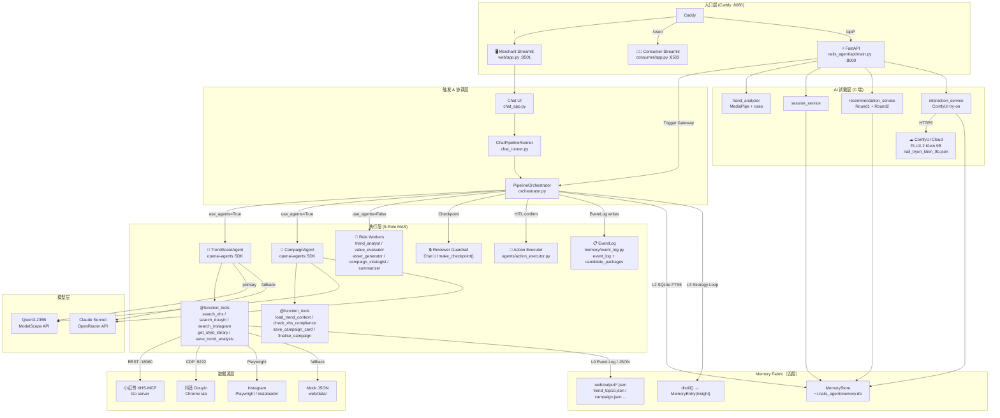

# 系统架构

> 美甲 AI 运营平台 — 技术架构参考文档  
> 设计来源：[Notion PRD v4](https://www.notion.so/faych/34e5f3c4a139801e806cd49a2af60591)

---

## 1. 产品定位与创新点

平台解决两个核心痛点，对应两个产品：

| 产品 | 服务对象 | 核心能力 |
|------|---------|---------|
| **智能运营**（B 端） | 美甲品牌运营人员 | 实时抓取社媒趋势 → LLM 生成三平台文案 → 排期上线 |
| **AI 试戴**（C 端） | 消费者 | 上传手部照片 → 肤色/手型分析 → 个性化款式推荐 → ComfyUI 效果预览 |

两个产品共用同一 FastAPI 后端、SQLite 数据库和 ComfyUI 图像生成服务。

### 五大创新点（K1–K5）

| # | 创新名称 | 描述 |
|---|---------|------|
| **K1** | 双链路共享 Memory 飞轮 | B 端运营数据（趋势/文案/排期）→ 影响 C 端推荐权重；C 端行为（点击/试戴）→ 反哺运营优先级决策。两条链路共享同一 MemoryStore，形成正向飞轮。 |
| **K2** | 自改进运营 Agent | Strategy Loop：每次 pipeline 运行结果写回长期记忆（`distill()` → `insight`），下次运营决策直接读取历史洞察，Agent 逐步进化而无需人工调参。 |
| **K3** | 扩散试戴超越 AR | 使用 FLUX.2 Klein 9B（ComfyUI Cloud）做扩散式试戴渲染，而非传统增强现实叠图。真实感远超 AR 贴图，且无需 3D 资产。 |
| **K4** | 端到端 MAS 闭环 | 从社媒数据采集、趋势分析、文案生成、到平台发布（Action Executor），全链路由多 Agent 系统（MAS）自动完成，人工仅在 Checkpoint 处介入。 |
| **K5** | 可配置审查闸门 | Reviewer Guardrail Agent 在任意步骤之间插入，由运营人员在 Chat UI 确认后才放行。闸门位置和通过条件均可配置，兼顾自动化效率与质量管控。 |

---

## 2. 九角色多 Agent 系统（MAS）

PRD v4 定义 9 个 Agent 角色，分三层部署：

```
┌─────────────────────────────────────────────────────────────────┐
│ 入口层                                                           │
│  Trigger Gateway ── 关键词路由 / Webhook / Cron 触发            │
└──────────────────────────┬──────────────────────────────────────┘
                           │
┌──────────────────────────▼──────────────────────────────────────┐
│ 协调层                                                           │
│  Orchestrator ── 全局调度，驱动下方执行层各步骤                   │
│      │                                                          │
│      ├── [Step 1] Trend Analyst                                 │
│      ├── [Step 2a] Value Evaluator  ┐ 并行                      │
│      ├── [Step 2b] Asset Generator  ┘                           │
│      ├── [Step 3] Campaign Strategist                           │
│      ├── [Step 4] Summarizer                                    │
│      ├── [*]      Reviewer Guardrail ── Chat UI Checkpoint 闸门 │
│      └── [Post]   Action Executor ── 多平台发布                  │
└─────────────────────────────────────────────────────────────────┘
```

### 角色清单

| # | 角色 | 职责 | 实现状态 |
|---|------|------|---------|
| 1 | **Trigger Gateway** | 接收触发信号（关键词/Webhook/Cron），路由到对应 pipeline | ✅ 独立 `trigger_gateway.py`，写 TriggerEvent 到 event_log，调用 Orchestrator.run_pipeline() |
| 2 | **Orchestrator** | 全局步骤编排，管理 PipelineState，驱动并行/串行执行 | ✅ `run_pipeline(TriggerEvent)` 全链路编排；每步写 EventLog |
| 3 | **Trend Analyst** | 采集社媒信号，聚合趋势，输出 `TrendAnalysisResult` | ✅ `TrendScoutAgent` + `trend_analyst` worker |
| 4 | **Value Evaluator** | 三维评分（热度/新鲜度/款式缺口），输出 `ValueEvaluationResult` | ⚠️ rule-based worker 已有，待接入 Orchestrator 编排链 |
| 5 | **Asset Generator** | 生成款式卡草稿，输出 `AssetGenerationResult` | ⚠️ rule-based worker 已有，MVP stub（不阻塞主链路） |
| 6 | **Campaign Strategist** | 生成三平台文案 + 定价排期，输出 `CampaignStrategyResult` | ✅ `CampaignAgent` + `campaign_strategist` worker |
| 7 | **Summarizer** | 汇总 Worker 输出为 `CandidatePackage`，写 candidate_packages 表 | ✅ `agents/summarizer.py` 输出 CandidatePackage，写 SummaryEvent |
| 8 | **Reviewer Guardrail** | 规则 + LLM 两层审查，输出 `ReviewDecision`（pass/revise/reject），HITL | ✅ `agents/reviewer_guardrail.py` 规则+LLM 两层，输出 ReviewDecision，HITL |
| 9 | **Action Executor** | 执行审核通过的动作（XHS 发草稿 + OpenClaw webhook），写 ActionEvent | ✅ `agents/action_executor.py` XHS 草稿+OpenClaw stub；HITL 确认后执行 |

> **注**：✅ = 已实现。全部 9 个角色均已 ✅ 实现（A0–A8，2026-05-16）。  
> openai-agents SDK 完全能表达 PRD v4 Orchestrator-Worker 模式，不迁移 Hermes。

---

## 3. 组件全图



---

## 4. 智能运营 — 4 步数据流

```
┌────────────────────────────────────────────────────────────────────────┐
│ 输入：TrendSignal[]（来自 XHS / Douyin / Instagram / Mock）              │
└──────────┬─────────────────────────────────────────────────────────────┘
           │
     Step 1 │ TrendScoutAgent (LLM) 或 trend_analyst.analyse() (rule)
           ▼
┌────────────────────────────────────────────────────────────────────────┐
│ TrendAnalysisResult                                                    │
│   top_10: List[TrendSignal]         — 高互动帖 top-10                  │
│   style_trends: List[StyleTrend]    — 按 tag 聚合，aggregated_score 降序│
│   patterns: List[str]               — 跨平台风格组合                    │
│   anomalies: List[str]              — 近 48h 突发热度                   │
│ → 写盘: web/output/trend_top10.json                                   │
│ → SQLite: memory(kind=trend/pattern/anomaly)                          │
└──────┬─────────────────────────────────────────────────────────────────┘
       │
       │  Step 2a (parallel) value_evaluator.evaluate()
       ├────────────────────────────────────────────────►
       │                                                  ValueEvaluationResult
       │  Step 2b (parallel) asset_generator.generate()  {snapshots[]: MetricSnapshot}
       └────────────────────────────────────────────────► web/output/metric_snapshots.json
                                                          AssetGenerationResult
                                                          {drafts[]: StyleCardDraft}
                                                          web/output/style_cards_draft.json
                                                  │
              [Reviewer Guardrail Checkpoint]      │
              Chat UI: "审核素材草稿？"           │
                    ↓ 确认                         │
                                            Step 3 │ CampaignAgent (LLM) 或 campaign_strategist (rule)
                                                  ▼
                                      CampaignStrategyResult
                                        {style_cards[]: StyleCard}
                                        each StyleCard: platform_variants (XHS/Douyin/IG)
                                                        pricing, schedule (P0/P1/P2)
                                        web/output/style_cards.json
                                        web/output/campaign.json
                                                  │
              [Reviewer Guardrail Checkpoint]      │
              Chat UI: "确认发布运营计划？"       │
                    ↓ 确认                         │
                                            Step 4 │ summarizer.summarise()
                                                  ▼
                                      SummaryReport
                                        {markdown, sections[], top_3_keywords}
                                        web/output/report.md
                                                  │
                                                  │ memory.distill()  ← K2 Strategy Loop
                                                  ▼
                                      MemoryEntry(kind=insight) — 跨 run 长期记忆
                                                  │
                                    ReviewDecision(status="pass")
                                      ↓ candidate_packages(review_status="pending_human")
                                      ↓ POST /api/v1/review/approve (HITL)
                                    [Action Executor]
                                      XHS 草稿发布 / OpenClaw webhook
                                      → ActionEvent 写入 event_log
```

Step 2a/2b 在 `ThreadPoolExecutor(max_workers=2)` 中并行运行；Step 1/3/4 串行；Reviewer Guardrail 可在任意步骤边界触发。

---

## 5. AI 试戴 — C 端 6 步流程

```
用户上传手部照片
       │
       ▼ POST /hand/analyze (multipart)
   MediaPipe 关键点检测 + 规则推断
       │  手型 (oval/square/round/almond/stiletto)
       │  肤色 (light/light-medium/medium/medium-dark/dark)
       │  色调 (cool/neutral/warm)
       ▼
   HandProfile → SQLite user_hand_profiles
       │
       ▼ POST /sessions (multipart)
   创建 TryOnSession + UserHandImage → SQLite user_sessions
   自动触发 Round 1 推荐（无需额外请求）
       │
       ▼ GET /sessions/{id}/recommendations/latest
   RecommendationSnapshot (Round 1)
   策略: reference_hand_match — 按手型 + 肤色匹配参考手型库
   ↑ K1: B端运营选出的款式库直接影响 Round1 候选集
       │
       ▼ POST /sessions/{id}/events (click / try_on_start)
   记录行为 → BehaviorEvent → 驱动 Round 2 偏好建模
   ↑ K1: C端行为写回 behavior_events，未来可反哺运营优先级
       │
       ▼ POST /sessions/{id}/recommendations/round2
   RecommendationSnapshot (Round 2)
   策略: session_visual_similarity_rerank — 视觉相似度 + 行为数据重排
       │
       ▼ POST /sessions/{id}/tryon {style_id}   ← K3 扩散试戴
   TryOnJob → ComfyUI Cloud (nail_tryon_klein_9b.json)
   FLUX.2 Klein 9B 推理 (~30-60s)
       │
       ▼ GET /sessions/{id}/tryon/latest
   {status, result_image_url}  — signed CDN URL, valid 6h
```

---

## 6. Memory Fabric — 四层架构

PRD v4 定义四层 Memory Fabric，当前已实现 L0–L3：

| 层级 | 名称 | 实现 | 生命周期 | 用途 |
|------|------|------|---------|------|
| **L0** | Event Log | JSON files (`web/output/`) | 永久（追加） | 原始事件审计；@function_tools 写盘 |
| **L1** | Short-term Memory | `PipelineState`（in-memory Pydantic） | 单次 pipeline run | 步骤间数据传递 |
| **L2** | Long-term Memory | `MemoryStore`（SQLite + FTS5） | 跨 run 持久 | 历史查询、趋势累积、消费者会话 |
| **L3** | Strategy Loop | `memory.distill()` → `MemoryEntry(kind=insight)` | 跨 run 累积 | K2 自改进：每次 run 提炼洞察，下次决策读取 |

**索引层**（Index Layer，部分实现）：
- FTS5 全文索引：已实现，支持中文款式标签和文案搜索
- CLIP 视觉向量：已实现（`nail_styles_v2.visual_feature`，用于 Round 2 视觉相似度重排）
- BERTopic 主题聚类：设计中（趋势聚合增强）

**L2 主要表**：

| 表名 | 内容 | 写入方 |
|------|------|--------|
| `memory` + `memory_fts` | pipeline 产出（trend/metric/insight/pattern/anomaly） | Orchestrator._persist_*() |
| `pipeline_runs` | pipeline 执行状态 JSON | Orchestrator |
| `nail_styles_v2` | 款式库（含 CLIP 视觉特征向量） | StyleLibrary service |
| `reference_hand_profiles` | 品牌手型参考样本 | seed_loader |
| `user_sessions` / `user_hand_images` / `user_hand_profiles` | C 端试戴会话 | SessionService |
| `recommendation_snapshots` | 推荐结果快照（Round 1/2） | RecommendationService |
| `behavior_events` | 用户点击/试戴行为（K1 双链路入口） | InteractionService |
| `tryon_jobs` | ComfyUI 任务跟踪 | InteractionService |
| `event_log` | pipeline 事件链（TriggerEvent/TrendEvent/StrategyEvent/ReviewEvent/ActionEvent） | TriggerGateway, Orchestrator, Summarizer, ReviewerGuardrail, ActionExecutor |
| `candidate_packages` | CandidatePackage（review_status: pending_review→pending_human→approved/rejected） | Summarizer, ReviewerGuardrail, ActionExecutor |

**`distill()` 机制（K2 Strategy Loop）**：每次 pipeline 完成后，`memory.distill(pipeline_id)` 遍历所有 `pattern` 条目，合并去重为 `insight` 条目，形成跨 run 长期趋势记忆。下次 TrendScoutAgent 调用 `load_trend_context()` 时优先读取这些 insight。

---

## 6a. MVP 架构补齐目标（2026-05-24）

> ✅ 已于 2026-05-16 全部完成（A0–A8）。以下为实现参考记录。

### 新增 SQLite 表

```sql
-- Event Log（PRD v4 §10 一等公民）
CREATE TABLE event_log (
    id          TEXT PRIMARY KEY DEFAULT (lower(hex(randomblob(16)))),
    event_type  TEXT NOT NULL,  -- TriggerEvent|TrendEvent|StrategyEvent|ReviewEvent|ActionEvent|FeedbackEvent
    trigger_id  TEXT,
    agent_id    TEXT,
    payload     TEXT NOT NULL,  -- JSON
    created_at  DATETIME DEFAULT CURRENT_TIMESTAMP
);

-- CandidatePackage（Summarizer → ReviewerGuardrail）
CREATE TABLE candidate_packages (
    id             TEXT PRIMARY KEY DEFAULT (lower(hex(randomblob(16)))),
    trigger_id     TEXT NOT NULL,
    content        TEXT NOT NULL,  -- JSON: CandidatePackage
    review_status  TEXT DEFAULT 'pending_review',  -- pending_review|pending_human|approved|rejected
    review_output  TEXT,           -- JSON: ReviewDecision
    created_at     DATETIME DEFAULT CURRENT_TIMESTAMP
);
```

### 新增 Python 文件

| 文件 | 职责 |
|------|------|
| `nails_agent/agents/trigger_gateway.py` | TriggerGateway 独立实现 |
| `nails_agent/agents/summarizer.py` | 升级为输出 CandidatePackage 的 Agent |
| `nails_agent/agents/reviewer_guardrail.py` | 规则 + LLM 两层审查 |
| `nails_agent/agents/action_executor.py` | XHS 草稿 + OpenClaw stub |
| `nails_agent/memory/event_log.py` | EventLog 读写封装 |
| `nails_agent/api/routes/trigger.py` | POST /api/v1/trigger, GET /api/v1/events |
| `nails_agent/api/routes/review.py` | POST /api/v1/review/approve |
| `nails_agent/api/routes/action.py` | POST /api/v1/action/publish |

新增 API 端点详见 [api_reference.md §MVP新增端点](api_reference.md#mvp-新增端点)。

---

## 6b. 前端迁移（Next.js）

当前 `web/`（Streamlit :8501）和 `consumer/`（Streamlit :8503）为过渡期实现，MVP 后由 **Next.js** 替代。

| 项目 | 当前 | MVP 后 |
|------|------|--------|
| B端 Dashboard | `web/chat_app.py` Streamlit :8501 | `frontend/app/(merchant)/` Next.js :3000 |
| C端 试戴 | `consumer/app.py` Streamlit :8503 | `frontend/app/(user)/` Next.js :3000 |
| 代理 | Caddy :8080 → :8501 / :8503 | Caddy :8080 → :3000 |

**技术栈**：Next.js 15 App Router · TypeScript 5 · Tailwind v4 · shadcn/ui · Zustand · TanStack Query v5  
**初始化**：见 [developer_guide.md §9](developer_guide.md#9-nextjs-前端开发)

---

## 7. 技术选型

| 方向 | 选择 | 理由 |
|------|------|------|
| **Agent 框架** | openai-agents SDK（原设计：Hermes Agent） | 原设计选型 Hermes Agent（NousResearch）；本次迁移至 openai-agents，原因：原生 `handoffs=[]`、`strict_mode=False` 容许 Qwen3 传 `list[dict]`、`AsyncOpenAI(base_url=...)` 直接对接 ModelScope |
| **主模型** | Qwen3-235B / ModelScope | 中文美甲文案流畅；demo 规模无 token rate-limit；无需出境 |
| **备用模型** | Claude Sonnet / OpenRouter | `MODELSCOPE_API_KEY` 缺失时自动切换；OpenRouter 提供 OpenAI-compatible endpoint |
| **规则 workers** | 并行保留 | 无任何 API key 时全链路可运行（demo / CI 模式） |
| **持久层** | SQLite + FTS5（原设计：Redis + Qdrant + Mem0） | 原设计 L2 用 Redis（短期），L3 用 Qdrant（向量）+ Honcho（对话记忆）；当前用 SQLite 统一简化，零运维，FTS5 支持全文检索 |
| **视觉向量** | CLIP embeddings（存 SQLite blob） | 用于 Round 2 视觉相似度重排；Qdrant 向量数据库为设计中升级路径 |
| **图像生成** | ComfyUI Cloud FLUX.2 Klein 9B | K3 扩散试戴；`nail_tryon_klein_9b.json` 固化两节点工作流 |
| **UI** | Streamlit | 最快实现人机协作流水线；`session_state` 实现 rerun-safe 事件回放 |
| **反向代理** | Caddy | 单二进制，自动 HTTPS，3 行路径重写搞定 `/user/` 和 `/api/` |

---

## 8. 端口与进程

| 进程 | 端口 | 启动方式 | 日志 |
|------|------|---------|------|
| FastAPI (uvicorn) | `:8000` | `./scripts/dev.sh` | `logs/api.log` |
| Merchant Streamlit | `:8501` | `./scripts/dev.sh` | `logs/merchant.log` |
| Consumer Streamlit | `:8503` | `./scripts/dev.sh` (baseUrlPath=/user) | `logs/consumer.log` |
| Caddy 反向代理 | `:8080` | `./scripts/dev.sh` (需安装 caddy) | `logs/caddy.log` |
| XHS-MCP Go server | `:18060` | `cd /tmp/xiaohongshu-mcp && go run .` | stdout |
| Chrome CDP | `:9222` | `Google Chrome --remote-debugging-port=9222` | — |

**通过 Caddy 访问（推荐）**：

```
http://localhost:8080/        → Merchant dashboard
http://localhost:8080/user/   → Consumer try-on
http://localhost:8080/api/    → FastAPI (prefix stripped)
```

---

## 关键参考文件

- [`nails_agent/agents/orchestrator.py`](../../nails_agent/agents/orchestrator.py) — 4 步流水线主逻辑
- [`nails_agent/api/main.py`](../../nails_agent/api/main.py) — 全部 REST 端点
- [`nails_agent/memory/store.py`](../../nails_agent/memory/store.py) — SQLite 读写封装
- [`nails_agent/agents/nail_agents.py`](../../nails_agent/agents/nail_agents.py) — Agent 定义（openai-agents SDK）
- [`nails_agent/agents/chat_runner.py`](../../nails_agent/agents/chat_runner.py) — Chat UI 11 相状态机
- [`nails_agent/agents/trigger_gateway.py`](../../nails_agent/agents/trigger_gateway.py) — TriggerGateway：标准化触发入口
- [`nails_agent/agents/summarizer.py`](../../nails_agent/agents/summarizer.py) — Summarizer：CandidatePackage 生成
- [`nails_agent/agents/reviewer_guardrail.py`](../../nails_agent/agents/reviewer_guardrail.py) — ReviewerGuardrail：规则+LLM 两层审查
- [`nails_agent/agents/action_executor.py`](../../nails_agent/agents/action_executor.py) — ActionExecutor：XHS+OpenClaw 发布
- [`nails_agent/memory/event_log.py`](../../nails_agent/memory/event_log.py) — EventLog：pipeline 事件一等公民
- [`scripts/dev.sh`](../../scripts/dev.sh) — 本地启动脚本
- [`Caddyfile`](../../Caddyfile) — 反向代理配置
- [agents.md](agents.md) — Agent 层深度参考（9 角色完整手册）
- [api_reference.md](api_reference.md) — REST 接口文档
- [developer_guide.md](developer_guide.md) — 本地开发与扩展指南
- [scoring_formulas.md](scoring_formulas.md) — 价值评估评分公式（K 维三维模型）
- [docs/develop/kanban.md](kanban.md) — KANBAN：A/B/AB 任务跟踪
