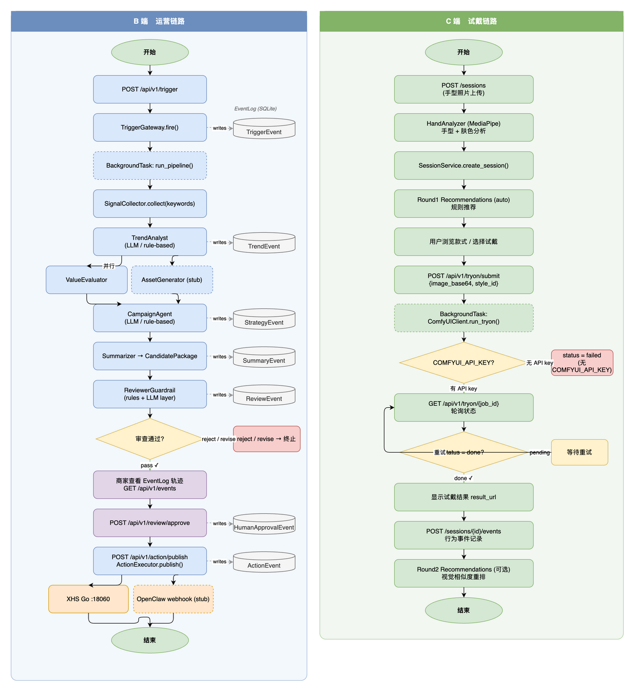

# nails-agent-platform 文档索引

## 产品文档

| 文件 | 说明 |
|------|------|
| [product/prd.md](product/prd.md) | PRD v4：背景、K1–K5 创新点、用户旅程、功能清单、Roadmap |
| [product/hand_upload_flow.drawio](product/hand_upload_flow.drawio) | C 端手部上传与试戴 6 步流程（draw.io 源文件） |

## 开发文档

| 文件 | 说明 |
|------|------|
| [develop/architecture.md](develop/architecture.md) | 系统架构：9 角色 MAS、Memory Fabric 四层、组件全图、技术选型 |
| [develop/agents.md](develop/agents.md) | Agent 层参考：9 角色规格、Tool 手册、Fallback 链、状态机 |
| [develop/api_reference.md](develop/api_reference.md) | REST API 完整参考：B/C 端所有端点 + Schema |
| [develop/developer_guide.md](develop/developer_guide.md) | 本地启动、扩展指南、测试、代码风格 |
| [develop/kanban.md](develop/kanban.md) | 任务看板：A/B/AB 三轨 KANBAN、MVP 进度、验收标准 |
| [develop/codebase.md](develop/codebase.md) | 代码文件索引：所有模块、脚本、测试文件说明 |
| [develop/scoring_formulas.md](develop/scoring_formulas.md) | 价值评估三维评分公式（热度 × 新鲜度 × 缺口） |
| [develop/acceptance_plan.md](develop/acceptance_plan.md) | 集成验收 checklist（curl 命令 + UI 验证点） |

---

## 架构图

### B端 + C端 端到端调用流程（自动生成）

> draw.io 源文件（含嵌入 XML，可直接在 draw.io 中编辑）：[assets/nails-agent-platform-flow.drawio](assets/nails-agent-platform-flow.drawio)

### 平台总览（待上传）

> 将 Notion 截图放入 `docs/assets/` 后生效。

### 多 Agent 协作流（待上传）

### C 端上传与试戴流程（待上传）

> draw.io 源文件：[product/hand_upload_flow.drawio](product/hand_upload_flow.drawio)
